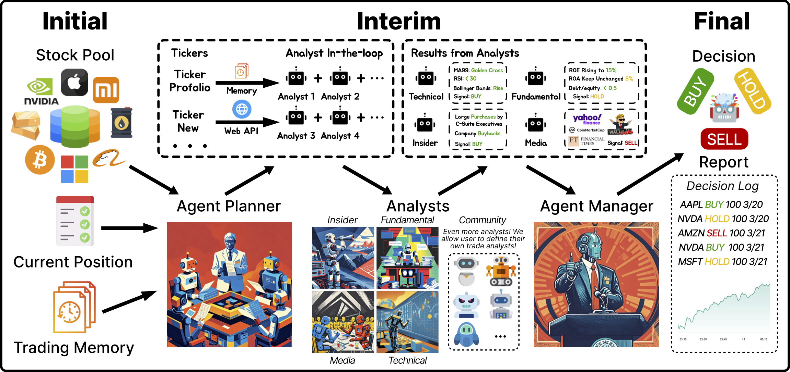
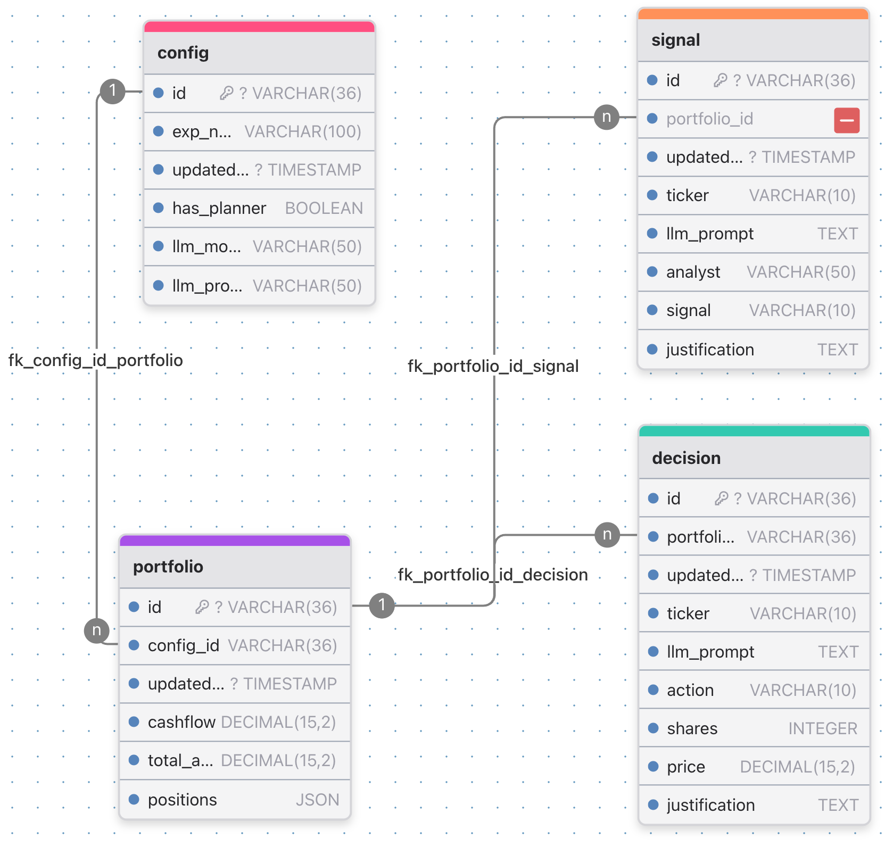

# DeepFund

[](https://arxiv.org/abs/2503.18313)

This project serves as an ideal solution to the below key question:

**Will LLM Be Professional At Fund Investment? A Live Arena perspective**

We evaluate the trading capability of LLM across various financial markets given a unified environment. The LLM shall ingest external information, drive a multi-agent system, and make trading decisions. The LLM performance will be presented in a trading arena view across various dimensions. 


> Disclaimer: This project is for educational and research purposes only, **it does not trade actually.**

## Framework



## Setup Environment
Pre-requisite: Install Conda (if not already installed): Go to [anaconda.com/download](https://www.anaconda.com/download/).

1. Clone the repository:
```bash
git clone https://github.com/tigerlcl/deepfund.git
cd deepfund
```

2. Create a virtual env from the env configuration file:
```bash
conda env create -f environment.yml
```

3. Set up environment variables:
```bash
# Create .env file for your API keys (OpenAI, DeepSeek, etc.)
cp .env.example .env
```

## Connect to Database
We support two database options via `--local-db` flag. 

### Option 1: Use **Supabase**
DeepFund connects to Supabase by default. 
- Supabase is a PostgreSQL-compatible Cloud Database
- You can create a free account on [Supabase](https://supabase.com/) 
- Refer to `src/database/supabase_setup.sql` to create the tables.
- Update the `SUPABASE_URL` and `SUPABASE_KEY` in `.env` file.

### Option 2: Use **SQLite**
SQLite is a lightweight database that stores data in a local DB file.
- Run the following command to **create a sqlite database** in the path
```bash
cd src
python database/sqlite_setup.py
```
- You may install VSCode Extension [SQLite Viewer](https://marketplace.cursorapi.com/items?itemName=qwtel.sqlite-viewer) to explore the database.
- Path: `src/assets/deepfund.db`

### Relation Diagram
ERD is generated by [drawdb](https://drawdb.app/)

<p align="center">
  
  <br>
  <em>DeepFundDB covers four tables: Config, Portfolio, Decision, and Signal</em>
</p>


## Running the System
Enter the `src` directory and run the `main.py` file with configuration:
```bash
cd src
python main.py --config xxx.yaml [--local-db]
```
Configs are saved in `src/config`. Below is a config template:
```yaml
# Deep Fund Configuration
exp_name: "my_unique_exp_name"

# Trading settings
tickers:
  - ticker_a
  - ticker_b

# Analysts to run, refer to graph.constants.py
workflow_analysts:
  - analyst_a
  - analyst_b
  - analyst_c

# LLM model settings, refer to llm/inference.py
llm:
  provider: "provider_name" 
  model: "model_name"
```
Specify `--local-db` flag to use SQLite.

### Static vs Dynamic Workflow
We use `workflow_analysts` configs to switch the mode:
- Static mode: If specified, predefined analysts are running in parallel without orchestration.
- Dynamic mode: If not specified, planner agent orchestrates which analysts to run from all registered analysts.

### Remarks
`exp_name` is unique identifier for each experiment. You shall use another `exp_name` for different experiments when `tickers`, `workflow_analysts`, or `llm` are changed.


## Project Structure 
```
deepfund/
├── src/
│   ├── main.py                   # Main entry point
│   ├── agents/                   # Agent build and registry
│   ├── apis/                     # APIs for external financial data
│   ├── config/                   # Configuration files
│   ├── database/                 # Database setup and helper
│   ├── example/                  # Expected output
│   ├── graph/                    # Workflow, prompt, and schema
│   ├── llm/                      # LLM providers
│   ├── util/                     # Utility functions and helpers
├── environment.yml               # For Conda
├── README.md                     # Project documentation
├── ...
```

## LLM Providers
- Official API Providers: OpenAI, DeepSeek, Anthropic, etc.
- Proxy API Providers: [YiZhan](https://vip.yi-zhan.top/), etc.
- Community API Providers: Ollama, etc.

## Financial Data Source Dependency
- Alpha Vantage API: Stock Market Data API, [Claim Free API Key](https://www.alphavantage.co)
  - Fundamental Analyst
  - Insider Trades Analyst
  - Technical Analyst
- YFinance API: Download Market Data from Yahoo! Finance’s API, [Doc](https://yfinance-python.org/)
  - News Analysts
  - Portfolio Manager


## Advanced Usage
### How to add a new analyst?

To add a new analyst to the DeepFund system, follow these general steps:

1.  **Define the Agent:**
  Create a new Python file for your analyst within the `src/agents/analysts` directory. Implement the core logic for your analyst within this file. This typically involves defining an agent function that takes relevant inputs (like tickers, market data), performs analysis (potentially using LLMs or specific APIs), and returns signals.

2.  **Define Prompts:**
  If your analyst uses an LLM, define the prompt(s) it will use. These might go in the `src/graph/prompts/` directory or a similar location.

3.  **Register the Analyst:**
  Make the system aware of your new analyst. This might involve adding its name or reference to a central registry in `src/graph/constants.py` or within the agent registration logic in `src/agents/registry.py`. Check these files for patterns used by existing analysts.

4.  **Update Configuration:**
  Add the unique name or key of your new analyst to the `workflow_analysts` list in your desired configuration file (e.g., `src/config/my_config.yaml`).

5.  **Add Data Dependencies (if any):**
  If your analyst requires new external data sources (e.g., a specific API), add the necessary API client logic in the `src/apis/` directory, and update environment variable handling (`.env.example`, `.env`) if API keys are needed.

6.  **Testing:**
  Thoroughly test your new analyst by running the system with a configuration that includes it. Check the database tables (`Decision`, `Signal`) to ensure it produces the expected output and integrates correctly with the portfolio manager.

Remember to consult the existing analyst implementations in `src/agents/` and the workflow definitions in `src/graph/` for specific patterns and conventions used in this project.

---

### How to add a new base LLM?

To integrate a new LLM provider (e.g., a different API service) into the system:

1.  **Implement Provider Logic:**
    Please refer to `src/llm/new_provider.py` for the implementation. We align the structure of the new provider with the existing providers.

2.  **Handle API Keys:**
    If the new provider requires an API key or other credentials, add the corresponding environment variable(s) to `.env.example` and instruct users to add their keys to their `.env` file.

3.  **Update Configuration:**
    Document the necessary `provider` and `model` names for the new service. Users will need to specify these in their YAML configuration files under the `llm:` section (e.g., in `src/config/provider/my_config.yaml`).
    ```yaml
    llm:
      provider: "" # The identifier you added in step 1
      model: "" # provider-specific settings here
    ```

4.  **Testing:**
    Run the system using a configuration file that specifies your new LLM provider. Ensure that the LLM calls are successful and that the agents receive the expected responses.

Consult the implementations for existing providers (like OpenAI, DeepSeek) in `src/llm/` as a reference.


## Acknowledgements
The project gets inspiration and supports from the following projects:
- [Cursor AI](https://www.cursor.com/), The AI Code Editor
- [AI Hedge Fund](https://github.com/virattt/ai-hedge-fund), An AI Hedge Fund Team
- [LangGraph](https://langchain-ai.github.io/langgraph/tutorials/workflows), Tutorial on Workflows and Agents
- [OpenManus](https://github.com/mannaandpoem/OpenManus), An open-source framework for building general AI agents
- [Supabase](https://supabase.com/), The Open Source Firebase Alternative

## Roadmap
> We are working on the following features. Collaborate with us!
- MCPify Deepfund
  - Turn APIs as LLM tools
  - Renovate the database query style
- Extend Financial Markets
- More ...

## License
This project is licensed under the MIT License - see the LICENSE file for details.
